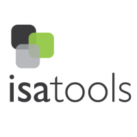

# nmrml2isa
Version: 0.3.0 

## Short Description

A container image definition for the nmrml2isa python tool

## Description

nmrml2isa is a Python3 program that can automatically generate ISA-Tab document structure metadata files from raw XML metabolomics data files (nmrML open access data format). The nmrml2ISA tool provides the backbone of ISA-Tab metabolomics study which can then be edited with an ISA editing tool, ISAcreator.

## Key features

- Extract meta information from mzML files and stores it as either python dictionary or JSON format
- Creates an ISA-Tab file structure with relevant meta information filled in.
- Add additional metadata that cannot be parsed from mzML files to the ISA-Tab files through a JSON formatted dictionnary.

## Functionality

- Other Tools

## Approaches
  
## Instrument Data Types

## Tool Authors

- [Martin Larralde](https://github.com/althonos)

## Container Contributors

- [Pablo Moreno](https://github.com/pcm32) (EMBL-EBI)

## Website

- https://github.com/ISA-tools/nmrml2isa


## Git Repository

- https://github.com/phnmnl/container-nmrml2isa.git

## Installation 

For local individual installation:

```bash
docker pull docker-registry.phenomenal-h2020.eu/phnmnl/nmrml2isa
```

## Usage Instructions

For direct docker usage:

```bash
docker run docker-registry.phenomenal-h2020.eu/phnmnl/nmrml2isa ...
```

## Publications

- Rocca-Serra, P., Brandizi, M., Maguire, E., Sklyar, N., Taylor, C., Begley, K., ... & Neumann, S. (2010). ISA software suite: supporting standards-compliant experimental annotation and enabling curation at the community level. Bioinformatics, 26(18), 2354-2356.
